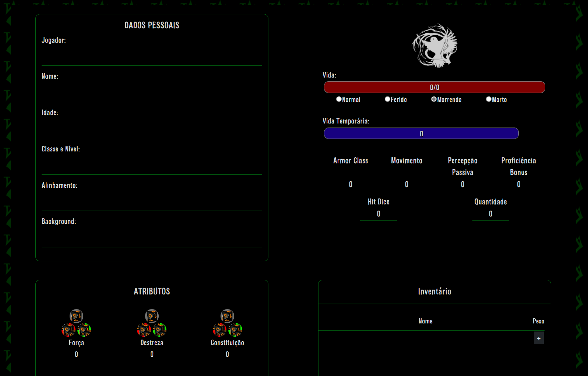
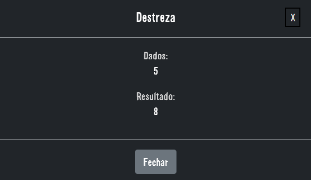

# Typescript D&D RPG Player Card with Firebase

This card was made for the RPG I participate in live, so this is why it is in portuguese.

It's open source. :clap:

| [:sparkles: Getting Started](#getting-started) | [:rocket: Installation](#installation) |
| --------------- | -------- |

<p align="center">
  
</p>
<p align="center">
  
</p>

## Getting Started

Follow the below instructions to get started:

1. [Make sure you have all Requirements](#requirements)
2. Create an account in [google firebase](https://firebase.google.com) and create a new project
3. [Download Source Code](#download)
4. Open Project in VS Code.
5. Open firebaseconfig.js and put your firebase project's configurations:
```js
var firebaseConfig = {
    apiKey: "YOUR_API_KEY",
    authDomain: "YOUR_AUTH_DOMAIN",
    projectId: "YOUR_PROJECT_ID",
    storageBucket: "YOUR_STORAGE_BUCKET",
    messagingSenderId: "YOUR_MESSAGING_SENDER_ID",
    appId: "YOUR_APP_ID",
    measurementId: "YOUR_MEASUREMENT_ID"
};
```

## Requirements

Make sure you have the below requirements before starting:

- [Visual Studio Code](https://code.visualstudio.com/)
- Basic Knowledge about Typescript and Firebase

## Installation

You can get access to the D&D Players Card source code by using one of the following ways:

- [:sparkles: Download Source Code](https://github.com/EricMarinho/Player-Card/archive/master.zip)
- Clone the repository locally:

```bash
git clone https://github.com/EricMarinho/Player-Card.git
```

## License

Made by [Ilidam](https://github.com/EricMarinho)
